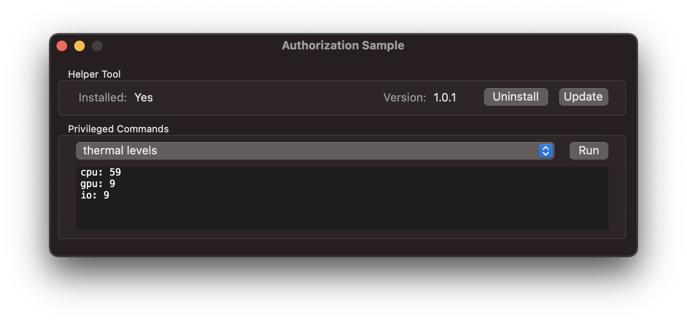

SwiftAuthorizationSample demonstrates how to run privileged operations on macOS using a helper tool managed by launchd.

This sample was created with the expectation that you already have an app and are looking to add a privileged helper
tool in order to perform one or more operations as root. As such this sample is **not** a template and is instead
written in a modular way which should make it easy for you to add portions of this code to your project as desired.

To try out this sample, configure your Development signing certificate for **both** the app and helper tool, then you
should be good to go. Sign to Run Locally is not supported as this would result in code requirements which cannot
securely identify the app and helper tool.

Read the following sections to learn how you can incorporate portions of this sample into your own project. The source
code of the sample also contains comments throughout.

If you run into issues with this sample it may be because of Xcode compatability issues; this sample was created with
Xcode 13.

## Sample Overview
When you run the sample you should see an app which looks like this (shown in dark mode):


Initially the helper tool won't be installed, so start by trying out that functionality.

Once the helper tool is installed you can run any of the privileged commands. These are a pretty arbitrary set of
macOS Command Line Tools and some of the arguments you can pass to them. The only commonality between them is
they require root access to run (and are non-destructive, since it is a sample after all).

Two of the commands say "[Auth Required]" and when run will require you to provide an admin password. This is done to
demonstrate how, if you so desire, you can self-restrict access to portions of your helper tool.

## macOS Support
This sample targets macOS 10.14.4 and above. If you would like to support pre-10.14.4 versions of macOS, the helper tool
cannot be written in Swift or [Swift 5 Runtime Support for Command Line Tools](https://support.apple.com/kb/DL1998) must
be installed. This is because the helper tool must be a Command Line Tool (not an app bundle) and starting with Swift 5
and Xcode 10.2, Apple made the decision to end support for embedding the Swift runtime into Command Line Tools.

Note: The helper tool, once installed, will **not** be run from inside of your app bundle and so it cannot target any
Swift runtime bundled with your app. (This is unlike XPC Services which may do this.)

All three Swift frameworks used by this sample target macOS 10.10 and later.

## Dependencies
Three Swift frameworks were created specifically for this helper tool use case:

- [Blessed](https://github.com/trilemma-dev/Blessed): Helper tool installation
  - Makes [SMJobBless](https://developer.apple.com/documentation/servicemanagement/1431078-smjobbless) functionality a
    single function call; no need to directly use Authorization Services
  - Enables advanced use cases with a full implementation of Authorization Services and Service Management
- [SecureXPC](https://github.com/trilemma-dev/SecureXPC): Communication between your app and helper tool
  - Easily send and receive [Codable](https://developer.apple.com/documentation/swift/codable) instances
  - Designed specifically for secure XPC Mach Services connections, which by default allow any process to communicate
- [EmbeddedPropertyList](https://github.com/trilemma-dev/EmbeddedPropertyList): Embedded property list reader
  - Directly read the info and launchd property lists embedded in the helper tool

Each of these frameworks have their own READMEs as well as full DocC documentation.

##  Installing a Helper Tool
macOS allows non-sandboxed apps to indirectly run code as root by installing a privileged helper tool. If you were to
directly use Apple's APIs you'd use the
[Authorization Services](https://developer.apple.com/documentation/security/authorization_services)
framework to have the user authenticate as an admin and then call 
[`SMJobBless`](https://developer.apple.com/documentation/servicemanagement/1431078-smjobbless) to perform
the installation. The [Blessed](https://github.com/trilemma-dev/Blessed) framework used by this sample simplifies this
to just one function call.

If this operation succeeds the helper tool will be copied from the `Contents/Library/LaunchServices` directory inside
your app bundle to `/Library/PrivilegedHelperTools/`. Once installed, it is managed by
[launchd](https://support.apple.com/guide/terminal/script-management-with-launchd-apdc6c1077b-5d5d-4d35-9c19-60f2397b2369/mac).

For this operation to succeed, Apple imposes numerous requirements:

1. Your app **must** be signed.
2. The helper tool **must** be signed.
3. The helper tool **must** be located in the `Contents/Library/LaunchServices` directory inside your app's bundle.
4. The filename of the helper tool **should** be reverse-DNS format.
    - If your app has the bundle identifier "com.example.SwiftAuthorizationApp" then your helper tool **may** have a
      filename of "com.example.SwiftAuthorizationApp.helper".
5. The helper tool **must** have an embedded launchd property list.
6. The helper tool's embedded launchd property list **must** have an entry with `Label` as the key and the value
   **must** be the filename of the helper tool.
7. The helper tool **must** have an embedded info property list.
8. The helper tool's embedded info property list **must** have an entry with
   [`SMAuthorizedClients`](https://developer.apple.com/documentation/bundleresources/information_property_list/smauthorizedclients)
   as its key and its value **must** be an array of strings. Each string **must** be a
   [code signing requirement](https://developer.apple.com/library/archive/documentation/Security/Conceptual/CodeSigningGuide/RequirementLang/RequirementLang.html).
   Your app **must** satisify at least one of these requirements.
    - Only processes which meet one or more of these requirements may install or update the helper tool. 
    - These requirements are *only* about which processes may install or update the helper tool. They impose no 
      restrictions on which processes can communicate with the helper tool.
9. The helper tool's embedded info property list **must** have an entry with 
   [`CFBundleVersion`](https://developer.apple.com/documentation/bundleresources/information_property_list/cfbundleversion)
   as its key and its value **must** be a string matching the format described in `CFBundleVersion`'s documentation.
    - This requirement is *not* documented by Apple, but is enforced.
    - While not documented by Apple, `SMJobBless` will not overwrite an existing installation of a helper tool with one
      that has an equal or lower value for its `CFBundleVersion` entry.
    - Despite Apple requiring the info property list contain a key named `CFBundleVersion`, your helper tool **must**
      be a Command Line Tool and **must not** be a bundle.
10. Your app's Info.plist **must** have an entry with 
      [`SMPrivilegedExecutables`](https://developer.apple.com/documentation/bundleresources/information_property_list/smprivilegedexecutables)
    as its key and its value must be a dictionary. Each dictionary key **must** be a helper tool's filename; for example
    "com.example.SwiftAuthorizationApp.helper". Each dictionary value **must** be a string representation of a code
    signing requirement that the helper tool satisfies.

### Satisfying These Requirements
While Apple imposes numerous requirements, many of them only need to be configured once. For the remainder, this sample
uses build variables and a custom build script to automate the process. In particular the build script handles:

- Generating the `SMPrivilegedExecutables` entry
- Generating the `SMAuthorizedClients` entry, with a code requirement that mitigates downgrade attacks
- Incrementing the helper tool's `CFBundleVersion` so that it can be updated
- Ensuring the helper tool's launchd `Label` value matches the helper tool's filename

Additionally the build variables, build scripts, and sample code are designed to avoid any duplicative hard coding of
values. If you follow the pattern used in this sample and ever wanted to change these values, you'd only need to
update them in one place each.

This section walks your through satisfying all of Apple's requirements.

#### 1 & 2. Code Signing
Xcode can automatically code sign for you. If you don't already have an Apple
[Developer ID](https://developer.apple.com/support/developer-id/) you'll need to provision one. If your build process
does not use Xcode for signing as part of the build process you'll likely need to modify the PropertyListModifier.swift
build script.

#### 3. Helper Tool Location

The exact steps for this may differ in future versions of Xcode. As of Xcode 13:

1. Open your project's `xcodeproj` file
2. Select your app's target
3. Switch to the Build Phases tab
4. Create a Copy Files Phase
5. Set the Destination as "Wrapper"
6. Set the Subpath to "Contents/Library/LaunchServices"
7. Add the helper tool product, for example "com.example.SwiftAuthorizationApp.helper"
8. Make sure "Code Sign on Copy" is checked

#### Build Variables
This sample relies on build variables to satisfy several of these requirements. You will need to set these build
variables for three different places:

 - the project
 - the app target
 - the helper tool target

The sample uses `xcconfig` files; however, you may do this using your `xcodeproj` file's Build Settings sections if you 
prefer. If you would like to use `xcconfig` files, but are unfamiliar with them then read through this
[excellent article by NSHipster](https://nshipster.com/xcconfig/).

For all of the entries needed, see the following `xcconfig` files:

 - Config.xcconfig
 - SwiftAuthorizationApp/AppConfig.xcconfig
 - SwiftAuthorizationHelperTool/HelperToolConfig.xcconfig
 
Note that the setting of some target specific values in the project level Config.xcconfig is essential as both build
processes needs access to this information. For example, at build time the app needs to know the identifier for the
helper tool in order to generate its `SMPrivilegedExecutables` entry.

#### 4. Helper Tool Filename
If you configured the build variables to match the sample, then what you specified as the value for the key
`HELPER_TOOL_BUNDLE_IDENTIFIER` will be used as the filename for the helper tool.

#### 5 & 7. Embedded launchd and Info Property Lists
In the root of the helper tool directory create a Info property list file with a
[`CFBundleVersion`](https://developer.apple.com/documentation/bundleresources/information_property_list/cfbundleversion)
entry. Unless you want to specify additional entries, you do not need to create a launchd property list as the build
script will do that for you automatically.

The compiler must be told to embed these property lists into the helper tool executable. If you configured the build
variables to match the sample your helper tool should have the following build variable configured:
```
OTHER_LDFLAGS = -sectcreate __TEXT __info_plist $(INFOPLIST_FILE) -sectcreate __TEXT __launchd_plist $(LAUNCHDPLIST_FILE)
```

Where `INFOPLIST_FILE` are `LAUNCHDPLIST_FILE` are build variables with values of the paths to the property lists.

Note: At runtime you can read the info property list as you would from an app bundle, but you cannot do so for the
      launchd property list. Neither of these property lists can be read externally as you would for an app bundle.
      For this reason, the [EmbeddedPropertyList](https://github.com/trilemma-dev/EmbeddedPropertyList) Swift framework
      was created.

#### 6, 8, 9, & 10. Property List Entries
The build script once properly configured will automatically generate these entries for you. The build script relies
on many of the build variables mentioned in the "Build Variables" section above. Make sure those are configured first.

Create a folder for build scripts (or use an existing one) and copy PropertyListModifier.swift to it. In order to be
run as a script the file must have its execute bit set. From Terminal, running `chmod 755 PropertyListModifier.swift` on
the script will make it world executable.

The following assumes you named that folder "BuildScripts". Now we need to configure your build process to run the
script. The instructions below are applicable for Xcode 13 and may differ in future versions.

In your `xcodeproj` file:

1. Select your app target
2. Switch to the Build Phases tab
3. Add a Run Script Phase which occurs right after the Dependencies Phase
4. Set the command to be run as `"${SRCROOT}"/BuildScripts/PropertyListModifier.swift satisfy-job-bless-requirements`

This will add the `SMPrivilegedExecutables` entry to your app's Info.plist each time the app is built. If you do not
want this auto-generated value to persist after the build process, take these optional steps:

5. Add a Run Script Phase as the last phase
6. Set the command to be run as `"${SRCROOT}"/BuildScripts/PropertyListModifier.swift cleanup-job-bless-requirements`

This will delete the `SMPrivilegedExecutables` entry from your app's Info.plist at the end of the build process. If
this results in an empty Info.plist then the property list will be deleted. The sample is configured to perform this
clean up step.

Next we'll configure the build script to run for the helper tool:
1. Select your helper tool target
2. Switch to the Build Phases tab
3. Add a Run Script Phase which occurs right after the Dependencies Phase
4. Set the command to be run as
   `"${SRCROOT}"/BuildScripts/PropertyListModifier.swift satisfy-job-bless-requirements auto-increment-version`
   
By specifying "satisfy-job-bless-requirements", the script will add the `SMAuthorizedClients` entry to the helper tool's
info property list and the `Label` entry to the launchd property list each time the app is built. The code requirement
created for the client intentionally goes beyond what is required to satisfy `SMJobBless`; specifically it requires that
the app be the same version or greater than the one which installed it. This prevents downgrade attacks where an older
version of the app had some exploit, so an attacker could load an old version of the app in order to communicate with an
already installed version of the helper tool.

If you do not want these entries to be persisted as part of the info or launchd property lists:

5. Add a Run Script Phase as the last phase
6. Set the command to be run as `"${SRCROOT}"/BuildScripts/PropertyListModifier.swift cleanup-job-bless-requirements`

By specifying "auto-increment-version", the script will increment the patch value of the `CFBundleVersion` entry if the 
source code has changed. In order for the script to determine if the source code has changed it creates an entry in your
helper tool's info property list with the `BuildHash` key and a value equal to the SHA256 hash of the helper tool's
source code. For the version number to continue autoincrementing you'll need to commit these changes. If you do not want
this autoincrement behavior, do not specify `auto-increment-version` as an argument for the build script. Note that
changes to framework dependencies will *not* cause an autoincrement.

## Communicating With a Helper Tool
Communication between your app and the helper tool should be thought of as a client server relationship.  Your app
functions as the client and the helper tool as the server. Similarly to communicating with a server over the Internet,
your app does not start or stop the server. While in theory there are multiple ways for your app to communicate with
the helper tool, in practice an XPC Mach Service should be used. Note that while this uses XPC for communication, this
does **not** make the helper tool an XPC Service.

launchd will ensure your helper tool is running if it needs to handle a request. If it was not already running when you
made a request, expect a small amount of initial latency.

Apple provides both C and Objective C APIs for XPC communication. Unfortunately, as of macOS 12 the Objective C API does
not provide a publicly documented way to secure the connection. (See
[this](https://support.apple.com/guide/terminal/script-management-with-launchd-apdc6c1077b-5d5d-4d35-9c19-60f2397b2369/mac)
Apple Developer Forums discussion on the topic.) Fortunately, since macOS 11 the C API **does** publicly provide this
functionality and there is an undocumented way to achieve the same result on older versions of macOS. The 
[SecureXPC](https://github.com/trilemma-dev/SecureXPC) framework used by this sample is built on top of the C API and 
requires all communication to be secured. It can be automatically configured to use the same code signing requirements
as `SMAuthorizedClients` in the helper tool's info property list which is what this sample does. Used in this manner,
the code requirement generated by `PropertyListModifier.swift` build script prevents older versions of the app from
communicating with the helper tool - providing a key part of downgrade attack prevention.

Note: While XPC allows for sending certain types of live references such as file descriptors, the SecureXPC framework
does not support this — it only sends serializable data.

### Registering an XPC Mach Server
For the helper tool to be an XPC Mach server, it must register to be one in its launchd property list. The build script
can do this for you automatically be adding the "specify-mach-services" argument. If you want this to be cleaned up at
the end of the build process, then for that Run Script Phase add the "cleanup-mach-services" argument. This sample is
configured to do both.

The script will set the service name to be the same as its bundle identifier, which in practice will also be its
filename and the value for `Label`. This is done purely for convenience; there is no requirement the service name use
the same identifier. Nowhere does the sample app or helper tool code assume they are the same.

### Security in Depth — Limiting Privileged Operations
While SecureXPC is designed to restrict which processes your server handle requests from, there's still the possibility
of exploits. (For example there could be a vulnerability in your app which gets exploited allowing for arbitrary code
execution.) As such it is a best practice to limit what actions your helper tool can do to the absolute bare minimum
required by your app. This way if an exploit exists it limits the damage. In the sample while the helper tool uses
`Process` to run executables as root, it does not honor requests for any arbitrary executable - only those specified in
the `AllowedCommand` enum are run.

### Security in Depth - Preventing Downgrade Attacks
If you discover your app has an exploit which attackers can use to communicate with your helper tool (and thererefore
perform privileged operations) it is of course obvious you should fix the security vulnerability in a future update of
your app. 

What may be less obvious is it's also important that your app update contain a new version of privileged helper tool and
that this helper tool be updated on end users' Macs. The helper tool does not need any code changes, it just needs to be
a new version such that it will accepted as an update.

If there's no code change, why is this needed? This is because while the code has not changed, the `SMAuthorizedClients`
entry in its info property list will have. Every time the project is built, the `PropertyListModifier.swift` build
script includes a requirement that the app have a minimum version of the current version being built. This requirement
is also used by `SecureXPC` so this means older versions of the app can't communicate with newer versions of the helper
tool. By updating helper tool, you'll be preventing attackers from subverting your security fix by running an older
version of your app and then exploiting it as before in order to communicate with the helper tool.

## Determining a Helper Tool's Install Status
Apple does not provide an API to determine the install status of a helper tool. However, this can still be achieved. See
SwiftAuthorizationApp/HelperToolMonitor.swift for an example. There are three different components that make up a helper 
tool being installed, it is not purely a yes/no situation. For example the helper tool could be registered with launch
control (the public interface to launchd) and yet the actual helper tool executable may not exist on disk.

## Uninstalling a Helper Tool
Apple does not provide an API to uninstall the helper tool. Their
[stated position](https://developer.apple.com/forums/thread/66821) is, "Users who don’t care won’t notice the leftover
helper." Despite not providing an API, it is *possible* for the helper tool to uninstall itself. See
SwiftAuthorizationHelperTool/Uninstaller.swift for an example of how to do so.

## Updating a Helper Tool
`SMJobBless` and the equivalent versions offered by the Blessed framework can with user authorization manually update an
installed helper tool. If your app would like to automatically update the helper tool without user involvement see
SwiftAuthorizationHelperTool/Update.swift for an example of how to do so. Note that this updater has certain 
self-imposed restrictions and will not perform an update in all circumstances. 

## Debugging a Helper Tool
The helper tool is run by launchd, not Xcode, and therefore can be challenging to debug. A reliable way to debug it
is to use [`NSLog`](https://developer.apple.com/documentation/foundation/1395275-nslog) as seen throughout the helper
tool's code. The output of these log statements can be viewed in 
[Console.app](https://support.apple.com/guide/console/welcome/mac), and it's recommended you filter the output to just
that coming from the helper tool's process. Note that `print` statements will not be viewable in Console.app, `NSLog`
must be used.

If you get the helper tool into a bad state, it may be helpful to uninstall it. You can uninstall the helper tool from
the command line by passing it the `uninstall` argument. You will need to use `sudo` to do this:
`sudo /Library/PrivilegedHelperTools/com.example.SwiftAuthorizationApp.helper uninstall`

If the helper tool is sufficiently broken that it can't handle uninstalling itself, you can do so manually:
```
sudo launchctl unload /Library/LaunchDaemons/com.example.SwiftAuthorizationApp.helper.plist
sudo rm -f /Library/LaunchDaemons/com.example.SwiftAuthorizationApp.helper.plist
sudo rm -f /Library/PrivilegedHelperTools/com.example.SwiftAuthorizationApp.helper
```

The `launchctl unload` command may fail if the helper tool is still running. If so, you can terminate it with Activity
Monitor.

## App Architecture & UI
The sample app's architecture and UI are not meant to serve as examples of how to best build a macOS app. Notably UI 
technology chosen was to support back to macOS 10.14.4 which does not support SwiftUI. Please consult other resources
for such guidance. 

## Other Considerations
While this sample shows one app installing and communicating with one helper tool, the relationship can be many to 
many. An app can install and communicate with arbitrarily many privileged helper tools. A helper tool could be
installed/updated by and communicate with multiple apps.

## Origin
This sample is inspired by Apple's no longer updated
[EvenBetterAuthorizationSample](https://developer.apple.com/library/archive/samplecode/EvenBetterAuthorizationSample/Introduction/Intro.html)
written in Objective-C. This sample is implemented exclusively in Swift. While Apple's sample has numerous known
[security vulnerabilities](https://theevilbit.github.io/posts/secure_coding_xpc_part1/), this sample has been designed
with security in mind. If you discover a security vulnerability, please open an issue!
